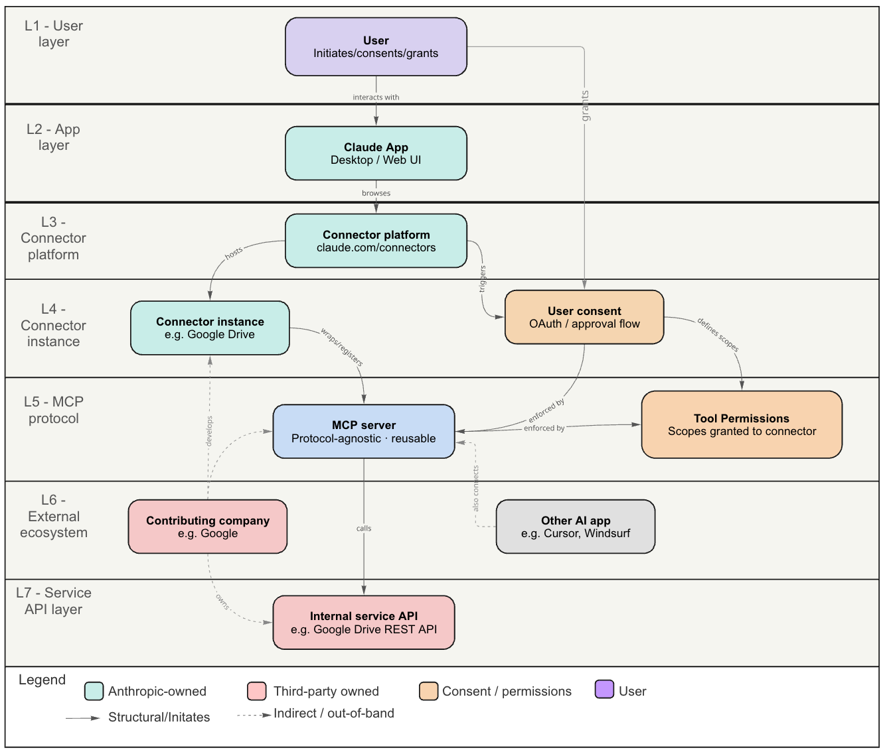

# MCP Connector Architecture — Research Dossier

**Topic:** Model Context Protocol (MCP) — connector architecture, entity relationships, layer mapping, and call-flow mechanics
**Researched:** 20 May 2026
**Updated:** 20 May 2026 (added layered entity map overlay)
**Platform:** Claude Sonnet 4.6 (claude.ai)

---

## Overview

This dossier documents the architecture, entity relationships, and runtime mechanics of the Model Context Protocol (MCP) as implemented in the Claude connector ecosystem. It covers how AI apps, connector platforms, MCP servers, service APIs, and user consent interact — and explains why MCP servers are inherently AI-app-agnostic.

---

## Layered Entity Map

The diagram below overlays the entity relationship model onto the architecture layer model, showing exactly which layer each entity inhabits and how relationships cross layer boundaries.




> **Key design insights from the overlay:**
> - The MCP server (L5) is the portability boundary — it receives arrows from both the layer above (connector instance + tool permissions) and the external ecosystem layer (other AI apps), and sends calls down to the service API.
> - User consent and tool permissions are peer entities at the same layer (L4), both feeding into the MCP server independently.
> - The contributing company (L6) has the widest reach of any entity — its dashed arrows climb to L4 (develops connector instance) and descend to L7 (owns service API), spanning three non-contiguous layers.
> - The user's "grants" relationship to user consent (L1 → L4) crosses the most layers of any relationship in the model, which is why it is indirect/out-of-band.

---

## Layer Architecture

| Layer | Entities | Role |
|---|---|---|
| L1 · User layer | User | Initiates sessions, grants OAuth consent |
| L2 · App layer | Claude App | UI that browses and enables connectors |
| L3 · Connector platform layer | Connector platform | Registry at `claude.com/connectors` |
| L4 · Connector instance layer | Connector instance, User consent, Tool permissions | Claude-specific binding of auth + scopes to an MCP server |
| L5 · MCP protocol layer | MCP server | AI-app-agnostic adapter; speaks JSON-RPC upward |
| L6 · External ecosystem layer | Contributing company, Other AI apps | Third-party developers and alternative AI clients |
| L7 · Service API layer | Internal service API | The real data service (REST, gRPC, SDK) |

---

## How an MCP Server Works — Call Flow

When an AI app invokes an MCP tool, the following sequence occurs:

### Step 1 — The AI app decides it needs a tool

The user's request causes the model to select a tool. At this stage the AI app has no knowledge of the underlying service — it only sees a tool name and JSON schema.

```json
{
  "tool": "gdrive_list_files",
  "input": { "limit": 10 }
}
```

### Step 2 — The AI app sends a standard MCP request

The call is wrapped in a standard MCP JSON-RPC envelope and transmitted over a transport (stdio, HTTP SSE, or WebSocket). This format is identical regardless of whether Claude or Cursor is the caller.

```json
{
  "jsonrpc": "2.0",
  "method": "tools/call",
  "params": {
    "name": "gdrive_list_files",
    "arguments": { "limit": 10 }
  }
}
```

### Step 3 — The MCP server receives and decodes it

The MCP server — typically a small local process — receives the envelope, parses the tool name, and routes to the registered handler. It has no knowledge of which AI app sent the request.

```js
handler = registry["gdrive_list_files"]
params  = { limit: 10, auth_token: "<stored>" }
```

### Step 4 — The MCP server calls the real service API

Auth tokens (stored during the OAuth consent flow at the connector instance level, L4) are injected here. The service API receives a normal API request with no awareness of MCP.

```http
GET https://www.googleapis.com/drive/v3/files
  ?pageSize=10
  &orderBy=modifiedTime+desc
Authorization: Bearer ya29.xxxxx
```

### Step 5 — The response travels back up

The service API returns data. The MCP server wraps it in a standard MCP tool result and returns it to the AI app.

```json
{
  "content": [{
    "type": "text",
    "text": "Q3 Report.docx — modified 2h ago\nBudget.xlsx — modified 1d ago"
  }]
}
```

### Step 6 — AI-app agnosticism in practice

Because the MCP server only speaks two languages — MCP upward and the service API downward — any conformant AI app can invoke it identically:

```
Claude App  --MCP--> gdrive-mcp-server --REST--> Google Drive API
Cursor      --MCP--> gdrive-mcp-server --REST--> Google Drive API
```

---

## Why MCP Servers Are AI-App-Agnostic

Four design decisions enable portability:

1. **Pluggable transport.** MCP supports `stdio` (local subprocess), HTTP with Server-Sent Events, and WebSocket. The same server binary can be launched by any host process.

2. **Self-describing tool discovery.** Before making calls, an AI app sends a `tools/list` request and receives a JSON schema of all available tools (name, description, input parameters). No hardcoded knowledge of the server is required.

3. **Auth is external to the protocol.** MCP has no opinion on authentication. Tokens are injected by the connector instance (the platform-specific wrapper, L4) before calls reach the MCP server. Each AI platform handles its own OAuth flow independently.

4. **The server is a thin adapter.** A typical MCP server for a service like Google Drive is ~200–400 lines. It registers tool names, maps inputs to API parameters, calls the API, and returns structured results. All AI reasoning, UI, and auth logic lives elsewhere.

---

## Key Distinctions

| Concept | Layer | Scope | Who owns it |
|---|---|---|---|
| MCP server | L5 | AI-app-agnostic; reusable across clients | Contributing company (e.g. Google) |
| Connector instance | L4 | Claude-specific; registered in `claude.com/connectors` | Contributing company + Anthropic platform |
| User consent | L4 | Tied to a specific connector instance | User (via OAuth flow) |
| Tool permissions | L4 | Scoped capabilities derived from consent | Defined at connector instance level |
| Service API | L7 | Independent of MCP; called by the MCP server | Service provider (e.g. Google) |

---

## References

- Anthropic connector platform: <https://claude.com/connectors>
- Google Drive connector instance: <https://claude.com/connectors/google-drive>
- MCP specification (Anthropic): <https://docs.anthropic.com/en/docs/agents-and-tools/mcp>
- Model Context Protocol open specification: <https://modelcontextprotocol.io>
- Google Drive REST API reference: <https://developers.google.com/drive/api/reference/rest/v3>
- JSON-RPC 2.0 specification: <https://www.jsonrpc.org/specification>

---

*Dossier generated from a research conversation with Claude Sonnet 4.6 on 20 May 2026. Updated same date with layered entity map overlay.*
